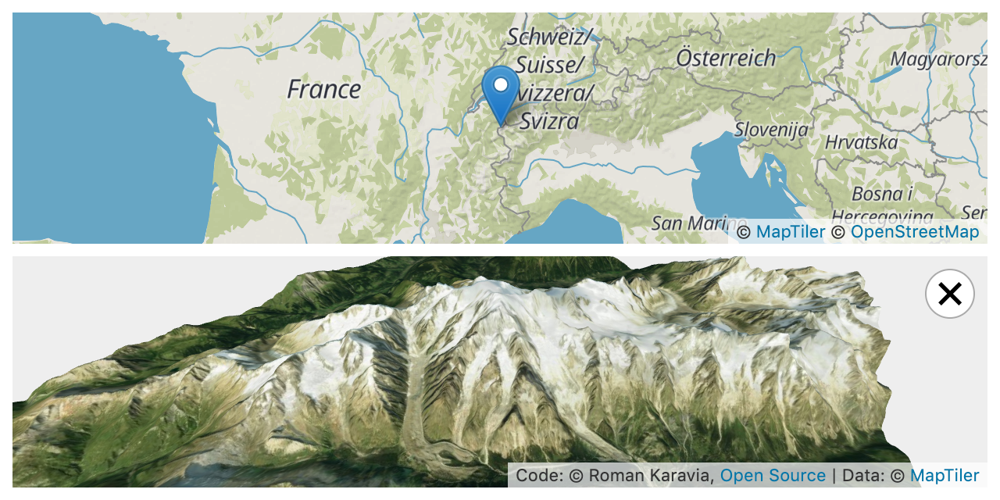

# MeshTiler

Get a 3D mesh of any place in the world using [MapTiler](https://www.maptiler.com), based on
[RGB Terrain](https://cloud.maptiler.com/tiles/terrain-rgb/) and
[Satellite](https://cloud.maptiler.com/tiles/satellite/) tiles.

This project has been created for the
[#MyMapTiler contest](https://twitter.com/MapTiler/status/1166349855654105090).
It is inspired by Vladimir Agafonkin's
[MARTINI: Real-Time RTIN Terrain Mesh](https://observablehq.com/@mourner/martin-real-time-rtin-terrain-mesh) Observable notebook.

Demo: **[Try it here!](https://mesh-tiler.karavia.ch)**

[](https://mesh-tiler.karavia.ch)


## Install

```
npm install
```

## Run

You will need a key from [MapTiler](https://cloud.maptiler.com/account/keys).

```
MAPTILER_KEY=<insert your key here> npm run dev
```

## License

This project is licensed under the MPL 2.0 license, see the LICENSE file.

## Acknowledgements

The following open source libraries have made MeshTiler possible:

- [MARTINI](https://github.com/mapbox/martini), © 2019 Mapbox,
  [ISC License](https://github.com/mapbox/martini/blob/master/LICENSE)
- [Svelte](https://svelte.dev), © 2016-2019 Svelte contributors
  [MIT License](https://github.com/sveltejs/svelte/blob/master/LICENSE)
- [Leaflet](https://leafletjs.com), © 2010-2011 CloudMade, © 2010-2019 Vladimir Agafonkin,
  [BSD 2-Clause License](https://github.com/Leaflet/Leaflet/blob/master/LICENSE)
- [three.js](https://threejs.org), © 2010-2019 three.js authors,
  [MIT License](https://github.com/mrdoob/three.js/blob/master/LICENSE)
